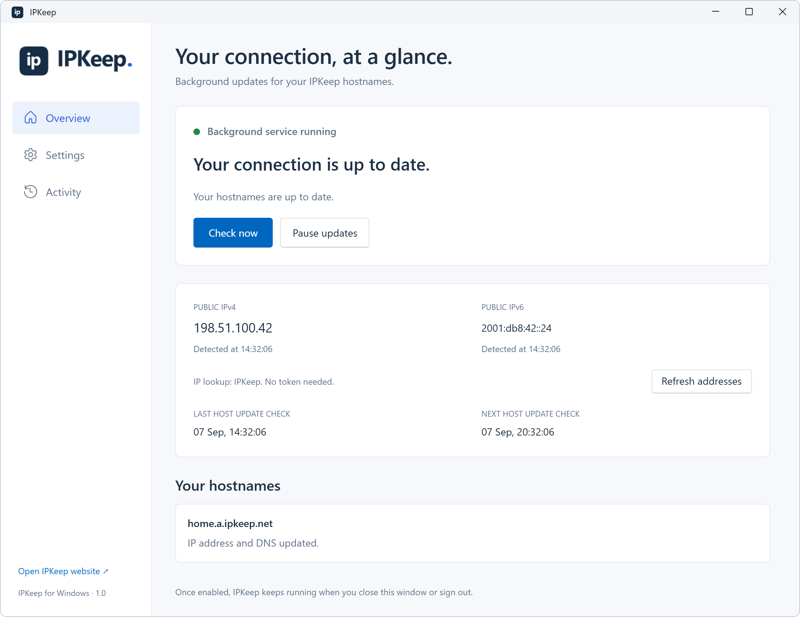

# IPKeep for Windows

A native WinUI 3 app and Windows background service that keep your [IPKeep](https://ipkeep.net/) dynamic DNS hostnames updated automatically. Connect with your own IPKeep API token, choose up to five existing hostnames, and let the service check your public IP in the background.

**Version 1.0.0 Preview 12** · Windows 10 version 2004 or later / Windows 11 · x64 · [MIT license](LICENSE)

[Build status](https://github.com/calxibe/ipkeep-windows/actions/workflows/build.yml) · [Preview downloads](https://github.com/calxibe/ipkeep-windows/releases) · [Code signing policy](CODE_SIGNING.md) · [Privacy](PRIVACY.md)

This repository contains the Windows client and service. An **unsigned beta installer** is provided for testing, alongside the folder/ZIP distribution. This release adds authenticated network diagnostics, read-only router WAN discovery and a local traceroute, while retaining permission warnings and guided repair. Automatic update downloads with user-approved installation are included. A signed installer and Microsoft Store distribution are not available yet. Preview 3–6 support update notifications and manual downloads; Preview 1–2 have no update checker. Install the current preview once to receive automatic downloads for future releases.



*Illustrative preview with fictional account, address, and activity data; it is not a live account capture.* [Settings preview](docs/images/settings.png) · [Activity preview](docs/images/activity.png)

## Preview 12: network diagnostics

A **Diagnostics** button beside each configured hostname opens a native network diagnostic. Every active API token can run diagnostics for its permitted hostnames; no separate permission needs enabling. Paused and revoked tokens are rejected. Normal address updates are unaffected.

Select **Test host** to collect this computer's public addresses, Windows DNS answers, selected local listeners, gateway ping and updater-service state, then request the existing Frankfurt/Virginia checks. The dialog shows incremental results, findings, automatic Cloudflare/Google DNS lookups, previous tests from this token, and a copyable monospace Full details report. Data sources are identified; unavailable readings do not count as successful tests.

Diagnostics uses the same currently selected **IP lookup service** as Overview. Its provider ID is saved with each report, and address results name that provider. Amazon Check IP is IPv4-only, so IPv6 address discovery is skipped; saved AAAA records and external IPv6 checks remain independent. A lookup failure stays unverified without falling back to a different provider. This matters with VPNs or multiple Internet connections, where different lookup services can observe different exit addresses. Background updates continue to use the selection saved in Settings. Preview 10 and earlier hard-coded diagnostics to IPKeep; run a new test with Preview 12 to collect corrected observations. Older reports remain unchanged.

**Advanced** shares the website's service selections and website hostname (HTTP Host/TLS name). Choose from 13 presets or a supported custom test/port. A blank Local device means this computer. For another device enter a private LAN IP; Local port may differ from Public port. Mappings are encrypted with DPAPI for this Windows user and scoped to the token/hostname. Manual WAN addresses are fallback-only and are never saved/restored as current evidence. Automatic replies take precedence. No firewall rules or port mappings are changed. Generic UDP/VPN reachability is not inferred from silence.

**Router WAN / CGNAT (Preview 12):** each test tries read-only UPnP `GetExternalIPAddress` and NAT-PMP external-address discovery against up to four configured on-link IPv4 gateways, within six seconds. Replies are bounded and pinned to the gateway; arbitrary URLs, redirects, credentials and XML entities are refused. Conflicting replies, possible VPN adapters and multiple gateways keep the conclusion inconclusive. A shared WAN (`100.64.0.0/10`) means CGNAT is likely; a private WAN may mean home double NAT or ISP NAT. A matching public WAN/lookup means no upstream IPv4 NAT was detected on that connection, without guaranteeing incoming reachability. VPN detection is best effort. If discovery is unavailable, enter the current WAN IPv4 from the router's Internet status in Advanced.

**Local traceroute:** Full details includes up to 12 IPv4 ICMP hops toward the selected lookup service, with one sample per hop, response time and explicit missing replies. The entire trace stops after seven seconds. This is a separate ICMP sample to a DNS-resolved provider address; HTTPS may follow a different path. Private/shared/silent hops never establish CGNAT. AWS-to-host traces remain separate.

Testing needs no elevation or new inbound listener. Authentication and current host access are checked on every API operation. Windows and browser jobs share account/target/global quotas (two pending jobs, six per ten minutes, 50 daily per account). Pausing/revoking a token or removing host permission cancels its pending work. Closing the dialog stops polling; an accepted regional job can finish. **Retry same test** preserves the UUID and original observations after an uncertain submission.

Local snapshots are uploaded only for a user-requested test and retained with its report for seven days; see [privacy](PRIVACY.md). Reports can also be viewed from the website's host diagnostics history. This source has an isolated Debug-only `--diagnostics-preview` fixture; it sends no network requests and never reads saved credentials. It is absent from release builds.

## Preview 8 changes

- Explains saved-connection and installation permission failures and offers **Fix in Settings**, including without administrator access.
- Shows repair steps in Settings: **Allow changes**, then **Save and enable updates** for private connection permissions, or **Repair / update service** for installation permissions. Elevated users see only the remaining steps.
- Labels retained hostname results as earlier results after a failed check and clears the permission warning when a completed check confirms the permission problem is gone.

The existing Windows approval and file-permission checks remain required. Repair guidance does not automatically change permissions or request elevation. Older service status files receive general setup guidance because they do not identify the precise cause.

## Preview 7 changes

- Downloads newer installers automatically, with progress, cancellation, and an option to receive notifications only.
- Verifies the published SHA-256 checksum before offering **Install update**, then checks the file again before opening Windows setup.
- Uses explicit release channels while the public default version feed offers the available preview until a stable release is published.

## Preview 6 changes

The service wakes its existing single-check queue after local network-address changes or restored connectivity, following a 10-second quiet period. Bursts are coalesced; stopped services stay stopped, and rejected credentials still require a replacement token or manual check. Periodic discovery remains necessary: a router's public WAN address can change without a local interface event.

The API can restrict tokens to selected hostnames; the Windows selector shows only enabled, permitted hosts. Deleting and recreating a hostname does not restore a selected token's old permission. Host listing, JSON updates and diagnostics use Bearer authentication with the same host scope.

## Features

- Token-based setup with automatic selection for one hostname, or a checkbox dropdown for up to five hostnames.
- Automatic IP checks, backoff after failures, and pause/resume controls.
- Choice of IPKeep, Amazon Check IP, ipify, or ident.me, with live IPv4 comparisons for VPN users.
- IPv4 and optional IPv6 updates, depending on the selected provider.
- Encrypted token storage using Windows DPAPI and restricted file permissions.
- Searchable activity in a compact table with local timestamps, row hover highlights, and rotating log files.
- Automatic app update checks and downloads, release notes, user-approved installation, and a GitHub fallback.
- Follows Windows light or dark mode, including changes while the window is open; light is the fallback.

## Getting started

Settings presents two clear steps: install the background service and connect your account with a verified token.

1. Download `IPKeep-1.0.0-preview.8-windows-x64-unsigned-setup.exe` from the preview release and run it. Windows administrator approval is required; this unsigned beta may show an unknown publisher or SmartScreen warning. Setup installs the app and its dependencies, adds a Start menu shortcut, and offers an optional desktop shortcut. Alternatively, build with `./build.ps1` or extract the complete ZIP to a permanent folder, keeping its files together.
2. Open `IPKeep.exe`. Viewing status/activity and verifying your own token do not require administrator access.
3. Open **Settings**. The **1. Background service** card shows whether the service is installed. Choose **Allow changes to install service** (or **Allow changes** above) and approve the Windows administrator prompt; the elevated app returns to Settings. Choose **Install service** in the card. This step is available before adding a token; installing alone does not start DNS updates.
4. Create your hostname and an API token at [admin.ipkeep.net](https://admin.ipkeep.net/). Hostnames can only be created and managed in that admin panel.
5. In **2. Connect your account**, paste the **IPKeep API token** and choose **Load my hostnames**. The card shows **Token verified** after a successful lookup; merely entering or restoring a token does not count as verification. A verified token is remembered encrypted for this Windows user. If the account has one active hostname, it is selected automatically and shown without a dropdown. If it has more than one, open **Hostnames for this computer** and check up to five. The dropdown shows the selected count, and unchecked choices are disabled at the limit until you uncheck another hostname. Only this account's enabled hostnames are offered; an empty list directs you to the admin panel.
6. Optionally open **IP lookup service** to compare the IPv4 returned by each provider. IPKeep is selected by default. Choose the service that reports the address you want to publish, especially when a VPN routes some destinations differently.
7. Choose **Save and enable updates**. If you connected your account first, the button instead says **Install service and enable updates** and installs the missing service as part of saving. This verifies every selected hostname, saves the encrypted token, all selected hostnames, and lookup provider, and starts the first check. All selected hostnames receive this computer's detected addresses. The window can then be closed.

This release supports Windows 10 version 2004 or later and Windows 11, x64. The build bundles .NET and the Windows App SDK, so target computers do not need to install those runtimes separately. The installer places the manager in `%ProgramFiles%/IPKeep/app`; the active service uses `%ProgramFiles%/IPKeep/service`. The ZIP remains an optional folder distribution. No Microsoft Store or MSIX registration is involved.

To update an installed beta, use **App updates → Install update** when available, or close IPKeep and run the newer installer from GitHub. Preview 6 and earlier need a manual upgrade to gain automatic downloads. Setup also detects applications holding its files open. An existing service is updated from the new bundle; running services resume and paused/disabled services retain their state. Saved settings, encrypted tokens, and activity logs are preserved. On a new computer, the installer leaves service installation to Settings. A newer installed installer version cannot be replaced by an older one. If a service update fails, setup reports it, returns exit code 20, and leaves the desktop available for repair; the service deployment attempts to restore its previous files.

When the API returns `dnsUpdated: false`, the app reports **IP recorded. DNS publishing pending.** It only reports published DNS when the API confirms it.

## Everyday use

- **Appearance:** follows the Windows app theme at startup and while open. Windows dark mode uses dark surfaces, readable text and controls, and the reversed IPKeep logo; light or an unavailable Windows preference uses the original light appearance. High contrast uses Windows system colors. Selected hostnames have blue checkboxes with contrasting checkmarks in light and dark mode (system highlight colors in high contrast). Unchecked boxes retain a visible outline.
- **Overview:** service state, public addresses detected when the window opens, last/next host update check, and a result for each configured hostname. Anonymous lookup of the provider's supported address families works immediately, even without a token, administrator access, or an installed service; Amazon shows IPv6 as not supported. **Refresh addresses** checks the current connection again. Each address shows its detection time or a specific lookup error. The provider is named, and an unsaved choice is labeled as a preview. Refreshing this preview does not send host updates or change the IPv6 update setting. **Check now** queues a service check without overlapping an active one.
- **Pause updates:** stops the service and changes startup to manual, so updates stay paused after reboot. **Enable updates** restores automatic startup and starts a check.
- **Settings:** restores the remembered token into the masked password field on normal launches. Each opening refreshes the account's active hostname list and preserves all still-active selections. One active hostname is selected automatically; the multi-select dropdown appears only when the account has more than one. Token editing, verification, and hostname selection work without elevation. Replace the token and choose **Load my hostnames** to verify and remember another account; changing tokens clears the previous choices until verified. Verified tokens are remembered even if no hostnames exist yet. Applying service settings still requires **Allow changes**. Select one to five hostnames per computer; the app cannot create or type in new hostnames. An older configuration with more than five is shown without silently truncating its choices; reduce it to five and save before using the updated service.
- **Restoring an older saved token:** when there is no token remembered for this Windows user, opening Settings requests one Windows administrator approval to recover the existing service token. Approve using the same Windows account; a different administrator account cannot export the token to your profile. Once restored, the app fills the masked field and looks up hostnames automatically, and later launches need no elevation for these lookups. If cancelled, choose **Load my hostnames** to retry or paste the token. The migration helper changes only the user's remembered token and does not change or restart the service. This Windows approval is required by the older credential file's administrator-only permissions.
- **Action messages:** retrying starts with a clear notification area. Successfully loading hostnames clears an earlier restore error; a new validation or storage error still appears if the current attempt fails.
- **Allow changes:** the elevation banner appears only in Settings. Clicking a field or opening a dropdown before elevation adds a steady yellow glow behind its button for four seconds without scrolling or interrupting input. High contrast uses the Windows highlight color. Leaving Settings clears the cue.
- **Setup visibility:** the Background service and Connect your account cards are always visible in Settings, including on a new computer with no token. The service card shows missing/installed/running status and the install action until installed. The account card shows Token required, Token not verified, or Token verified. The hostname field, IP lookup service, Advanced options, and save action stay hidden until the token successfully loads at least one active hostname. Changing the token or reloading the list hides them while verification runs; failed/empty lists and rejected tokens keep them hidden. Saved hostnames alone do not count as verification. Save requires one to five selected hostnames and administrator access.
- **IP lookup service:** opening the dropdown checks all providers concurrently over IPv4. Each row changes from Checking to its returned address or Unavailable; hover a failed row for details. Each request has a ten-second timeout, reopening refreshes all results, and old responses cannot overwrite a newer comparison. Lookup requests remain anonymous even though the Settings controls require a verified hostname list. Selecting a provider immediately previews its addresses in Overview; save settings to use it for background updates. Amazon supports IPv4 only, so selecting it turns off IPv6 updates. IPKeep, ipify, and ident.me support both families.
- **Advanced options:** 1–1,440 minutes between checks (default 360), optional IPv6, and ignored IP addresses/CIDR ranges (one per line). IPv4 is always checked. Enable IPv6 only on a connection that supports it. Ignored or unavailable addresses are omitted, preserving the corresponding saved server address.
- **Activity:** the latest 200 entries in a compact **Time (local), Level, Message** table, newest first, refreshed every two seconds. Timestamps are converted to the computer's local timezone using the offset applicable to each event, including daylight-saving changes. The short format is `07 Sep, 14:32:06`; hover a timestamp for its full date/year and offset. Timestamps inside messages, such as the next check time, are also displayed locally. Rows gain a subtle full-width background on hover, including over selectable text, and return to normal when the pointer leaves. Long messages wrap within their column. Filtering matches both the displayed local text and the original log line. Malformed/incomplete lines remain visible with an unavailable timestamp. **Open log folder** opens the original files, whose full timestamps and offsets are preserved.
- **Service maintenance:** appears for an installed service, even when stopped or when the token is missing/rejected, so it can still be repaired or removed. First-time installation is in the visible Background service card. Maintenance repairs/updates the service from the adjacent `service` folder, or removes the service registration. Changes require administrator access. Removal retains settings and logs and reveals the install action again. The previous service directory is retained under a uniquely named `service-previous-*` folder when updating, and restored if installation fails.

## App updates

The desktop checks for new application releases when it opens and every six hours while it remains open. **App updates → Check for updates** checks manually, without a token or administrator access. A newer release shows a banner on any page; **View changes** opens its version, local release date, and short notes in a read-only, scrollable text box. By default, the app downloads a newer installer automatically and verifies its checksum. Progress and **Cancel download** appear on App updates. Turn off **Download updates automatically** for notifications only; **Download update** remains available. This preference is remembered for the Windows user.

**Install update** checks the file again and opens the normal unsigned Windows setup. It requires the user's click and Windows administrator approval. IPKeep closes after Windows accepts the launch; setup preserves settings and performs the existing service upgrade. Setup is interactive and cannot restart Windows automatically. Cancelling Windows approval keeps IPKeep open. **Download from GitHub instead** opens the fixed [GitHub Releases](https://github.com/calxibe/ipkeep-windows/releases) page. Preview 6 and earlier need one manual upgrade to receive these download controls.

Requests use the public `GET https://api.ipkeep.net/version?channel=stable` feed. Preview builds also check `?channel=preview` and offer the highest newer semantic version across both channels, including graduation to stable. Stable builds check only stable releases. Equal/older releases and build-metadata-only differences are not offered. Empty channels (`NO_RELEASE`) are normal; failures show retry guidance on App updates, never a token error or a false up-to-date result. An already found update remains visible during an outage, but an incomplete check does not start an automatic download. Dismissing its banner lasts for this window; the release details remain on App updates. Closing the window cancels requests and stops application checks/downloads; the DNS service keeps its independent schedule.

Version requests send no token, hostname, cookies, or IP lookup results. Redirects are disabled, responses are limited to 16 KB, and requests time out after ten seconds. Notes are plain text, capped at 1,000 characters. The API caches metadata for ten minutes, so newly published releases may take that long to appear.

Installer downloads use the exact version's `SHA256SUMS.txt` and `IPKeep-<version>-windows-x64-unsigned-setup.exe` from this project's GitHub release. The feed cannot choose a download URL. Only HTTPS redirects within that project or to GitHub's release-asset CDN are allowed. Checksums are bounded to 16 KB and installers to 256 MB, with a 15-minute overall timeout. A mismatch or incomplete download leaves no new installer; cached files are verified before reuse and again before launch. Files and the download preference are kept in the current user's restricted `%LOCALAPPDATA%/IPKeep/Updates` folder. Downloaded installers retain Windows' Internet-zone marker. Checksums verify the download against the HTTPS-hosted release; they are not an Authenticode signature. Windows may still show unknown-publisher or SmartScreen warnings. No silent installation or security-warning bypass is implemented.

`Directory.Build.props` supplies the complete release `Version` (including `-preview.N`) to the compiled desktop/service, metadata, ZIP, and installer. `FileVersion` supplies the installer's monotonically increasing four-part Windows version. Increment both for each preview; a final stable installer must also have a higher Windows file version than the last preview. Packaging checks the compiled assemblies against the declared release version and rejects a mismatched Git tag.

## Network contract

Customer API tokens authorize hostname listing, address updates and host-scoped diagnostics. `GET https://api.ipkeep.net/hosts` returns `{ "hosts": [{ "hostname": "home.ipkeep.cloud" }] }` for the token owner's active hostnames permitted by its scope, or an empty array. The client accepts only valid managed hostnames, binds the selection to the token that loaded the list, and retrieves the list again before saving. Empty, failed, or stale lists cannot enable updates.

Updates are `POST https://api.ipkeep.net/update`, with JSON containing `hostname` and the available `ipv4` / `ipv6` fields. Authenticated endpoints use `Authorization: Bearer <IPKeep token>`. Redirects and cookies are disabled. Their URLs are fixed; there is no editable URL that could receive the token. HTTP response bodies, authentication headers, and tokens are never logged. A 401/403 asks for a new or enabled token; a 404 asks the user to check the hostname/account/paused state.

Client tokens cannot create, delete, rename, enable, or pause hostnames; manage accounts, tokens, authentication or sessions; read account activity; or access internal DNS-node routes. Hostname management requires the admin panel's authenticated browser session. `/ip` and `/version` are anonymous, not additional token capabilities. Keep hostname management separate from these host-scoped client operations. The Windows client contains no infrastructure credentials and makes no direct DNS-provider API requests.

Public IP discovery sends anonymous HTTPS GET requests to the selected provider. No lookup provider receives the IPKeep token, hostname, or update body. The free alternatives use these documented endpoints:

| Provider | IPv4 | IPv6 | Response |
| --- | --- | --- | --- |
| IPKeep (default) | `https://api.ipkeep.net/ip` | Same URL over IPv6 | JSON with `ipv4` / `ipv6`; the unobserved family is null |
| [Amazon Check IP](https://docs.aws.amazon.com/us_en/batch/latest/userguide/create-a-base-security-group.html) | `https://checkip.amazonaws.com/` | Not supported | Plain IPv4 address |
| [ipify](https://www.ipify.org/) | `https://api.ipify.org/` | `https://api6.ipify.org/` | Plain IP address |
| [ident.me](https://api.ident.me/) | `https://4.ident.me/` | `https://6.ident.me/` | Plain IP address |

The dropdown follows this order: IPKeep first and selected by default, Amazon Check IP as the preferred alternative, then ipify and ident.me.

The stable `IpLookupProviderId` is saved with the connection and its public settings projection. Existing settings without this field default to `ipkeep`. The service reads it for each check; it never switches automatically after a failure, since another provider may see a different VPN exit. Future providers, including the planned Azure endpoint, belong in `src/IPKeep.Core/IpLookupProviders.cs` with a stable ID and explicit response format. Custom URLs are not supported.

DNS resolution, sockets, and connection pools are kept separate for IPv4/IPv6. Discovery bypasses HTTP proxies, follows the computer's OS/VPN routes, disables redirects/cookies, and retains HTTPS certificate validation. Choosing a provider does not change VPN routing. Null, invalid, private, and wrong-family values are rejected and never clear saved addresses. There are no automatic provider fallbacks or direct Cloudflare DNS API requests; discovery failures use the normal five-minute retry. The default lookup timeout is twenty seconds; dropdown probes use ten seconds.

Every start checks immediately. Successful and ignored checks use the configured interval; failures begin with a five-minute retry and back off up to an hour, bounded by the configured interval. Delays begin when a check finishes. A failed hostname does not prevent the other hostnames from updating; a rejected token stops redundant requests for the remaining hosts and pauses timed retries until the user saves a new token or requests a check. A missing enabled address family still allows the other family to update and schedules a retry. Cancellation stops in-flight requests on service shutdown.

## Local storage and service permissions

| Item | Location |
| --- | --- |
| Desktop installed by setup (including service deployment bundle) | `%ProgramFiles%/IPKeep/app/` |
| Service executable and dependencies | `%ProgramFiles%/IPKeep/service/` |
| Public settings (no token) | `%ProgramData%/IPKeep/settings.json` |
| Encrypted connection/settings | `%ProgramData%/IPKeep/Private/connection.bin` |
| Remembered desktop token for this Windows user | `%LOCALAPPDATA%/IPKeep/Private/token.bin` |
| Status | `%ProgramData%/IPKeep/Activity/status.json` |
| Log | `%ProgramData%/IPKeep/Activity/service.log` |

The service is named `IPKeep` and runs as **LocalService**. Installation and connection changes require Windows administrator access. Program files and settings are writable only by Administrators and SYSTEM; LocalService can read the connection and write only the Activity directory. Standard users can read public settings and activity, but cannot read the private connection directory. Windows DPAPI encrypts the connection for this computer; protected filesystem permissions restrict who can read its ciphertext. The plaintext token exists only in memory when entered or used. Copying the encrypted connection to another computer is not a supported migration method; enter a token there instead.

The desktop separately remembers verified tokens with DPAPI **CurrentUser**, using a private local directory limited to the current Windows user and SYSTEM. This lets the normal desktop launch retrieve hostname choices without exposing the service's machine-protected connection to standard users. The restored field contains the actual token under password masking. A failed token verification does not overwrite a previously remembered token; errors hide hostname-dependent options. The migration helper checks elevation and the requesting Windows SID, accepts no caller-supplied storage path, and never puts a token on the command line. Saving or clearing service configuration does not implicitly remove this Windows user's remembered token.

The service verifies its installed location and permissions before starting and before every check. It refuses workspace execution. Links/junctions in protected paths are rejected. Settings/status writes use atomic replacement. Logs rotate at approximately 2 MB, retaining the current file plus five archives. IP addresses and hostnames are intentionally present in activity logs; credentials are not.

For a permission warning, choose **Fix in Settings** and follow the displayed steps. If the problem persists, run [scripts/diagnose-permissions.ps1](scripts/diagnose-permissions.ps1) in an administrator PowerShell on the affected computer. It reports the service registration and ownership/access rules for the files and directories checked during an update. It reads no token contents and changes nothing. Standard-user access to the Private folder is normally denied, so a non-elevated report cannot diagnose that folder. Preview 7 and earlier report the generic `Check failed (UnauthorizedAccessException)` message; Preview 8 distinguishes known permission failures using `InstallationPermissionException` and specific repair guidance. Do not weaken the private directory's permissions to clear the warning.

If that report identifies an extra account with access to the Private folder or saved connection, open **Settings → Allow changes**, load/verify your token and selected hostnames, then **Save and enable updates**. Saving restores the private folder's intended permissions and replaces the encrypted connection before restarting the service. This repairs that specific permission problem without reinstalling the application. Check Activity for a successful fresh update afterward; other permission failures need their own diagnosis.

## Source and build

- `src/IPKeep.Core`: hostname/settings validation, protected storage, HTTP clients, check orchestration, log rotation, service installation/control.
- `src/IPKeep.Service`: Windows service lifecycle, immediate/interval/retry scheduling, cancellation and manual check queue.
- `src/IPKeep.Desktop`: native WinUI 3 application and bundled IPKeep artwork.
- `tests/IPKeep.Tests`: isolated executable test suite with fake HTTP/resolver/update services and temporary files.
- `docs/images`: illustrative app previews containing fictional data.

Build tools: Windows, PowerShell 7, .NET SDK 10.0.400 (pinned in `global.json`), and Windows desktop/WinUI build prerequisites, including the Windows SDK. The project pins Windows App SDK 2.4.0, listed as stable in [Microsoft's downloads](https://learn.microsoft.com/en-us/windows/apps/windows-app-sdk/downloads). Distribution follows [Microsoft's unpackaged WinUI guidance](https://learn.microsoft.com/en-us/windows/apps/package-and-deploy/unpackage-winui-app).

```powershell
git clone https://github.com/calxibe/ipkeep-windows.git
cd ipkeep-windows
./build.ps1                  # tests, then self-contained x64 desktop + service
./build.ps1 -NoTest          # publish without tests
./build.ps1 -OutputDirectory dist/IPKeep-multihost  # build separately while another copy is open
# Package a fresh publish and build the unsigned beta installer (Inno Setup 6.7+):
./scripts/package.ps1 -Commit (git rev-parse HEAD)
./scripts/build-installer.ps1
# Tests only:
dotnet run --project tests/IPKeep.Tests/IPKeep.Tests.csproj -c Release
# Optional: also verify the anonymous IPv4 discovery endpoint live (no token):
dotnet run --project tests/IPKeep.Tests/IPKeep.Tests.csproj -c Release -- --live-ipv4
# Optional: verify anonymous IPv4 discovery against every dropdown provider:
dotnet run --project tests/IPKeep.Tests/IPKeep.Tests.csproj -c Release -- --live-providers
# Optional: also check the anonymous release feeds live:
dotnet run --project tests/IPKeep.Tests/IPKeep.Tests.csproj -c Release -- --live-version
# Optional: download/checksum the published Preview 6 installer without running it:
dotnet run --project tests/IPKeep.Tests/IPKeep.Tests.csproj -c Release -- --live-installer
```

Building never installs, starts, or stops a service and does not send production updates. Tests cover request destination/authentication, hostname-list parsing, empty/invalid lists, token-bound selection and stale-load rejection, provider persistence/defaults and routing of update addresses, independent concurrent probes and stale-result cancellation, response validation/redaction, error handling, IPKeep JSON and plain-text discovery, separate IPv4/IPv6 transports (including real loopback sockets), hostname/CIDR validation, partial failures, IPv6 omission, ignored networks, cancellation, non-overlapping checks, retry decisions, log retention, atomic saves, Windows encryption, and the workspace runtime guard. Default tests use fake responses and local loopback connections; only the explicit `--live-ipv4` / `--live-providers` options contact public discovery endpoints.

## Validation and remaining release checks

The current source has 88 isolated tests, including permission diagnostics, access-control boundaries, safe public messages, retained hostname history and recovery. Other tests cover installer checksum failures, corruption/truncation, size limits, trusted redirects, cache reuse/tampering, Internet-zone marking, cancellation, launch validation and per-user preferences. The launch test substitutes a callback and never executes the fixture bytes. The suite also covers HTTP/token boundaries, one-to-five hostname selection, restoring multiple selections, automatic single-host selection, fresh validation of every selected hostname, updates to all five hosts, provider behavior, storage and encryption, scheduling/backoff and stopping retries for rejected tokens, log handling, Activity timestamp formatting, installer command/cleanup boundaries, and application update checks. Update tests include semantic version ordering, stable/preview selection, empty feeds, malformed/oversized metadata, plain-text notes, fixed destinations, anonymous requests, partial failures, timeouts, and cancellation. Native layouts and live anonymous discovery/release feeds have also been inspected during development.

The GitHub Windows build compiles the installer using [Inno Setup](https://jrsoftware.org/isinfo.php) and runs `tests/IPKeep.InstallerTests` on a disposable administrator runner. That suite exercises fresh setup, shortcuts, Installed Apps registration, running/paused/disabled service upgrades, a blocked service update and repair, downgrade/path refusal, uninstall, reinstall, and retention of settings/connection/activity files. Its deliberately invalid encrypted connection cannot authorize DNS updates. The suite refuses to run on a normal workstation or one with existing IPKeep files/data. Installer logs are retained as a separate build artifact.

Before broad distribution, remaining checks include interactive Windows 10/11 testing, reboot, live token restoration across launches, service-maintenance visibility for existing installations, and native visual/keyboard verification of the new multi-select dropdown. Code signing remains pending. Building an installer does not install it on the developer's computer.

## Removing IPKeep

For an installer-based installation, close IPKeep and choose **IPKeep → Uninstall** in Windows **Settings → Apps → Installed apps**. This stops and unregisters the service and removes the installed desktop, service files, and shortcuts. Settings, encrypted tokens, and logs are retained for reinstallation; no account or hostname is deleted. If service removal fails, uninstallation stops and reports the error rather than removing its management files.

For an older ZIP/folder installation:

1. Open Settings, choose **Allow changes**, and approve the Windows administrator prompt.
2. Expand **Service maintenance** and choose **Remove service**. This stops and unregisters the background service; it retains its files and data.
3. Close every IPKeep desktop window. You can now delete the extracted application folder and the installed `%ProgramFiles%/IPKeep/service` files (administrator access is required for Program Files). If you also installed the desktop through setup, use its Windows uninstaller instead of deleting its folder.
4. If you also want to erase local settings, tokens, and logs, delete `%ProgramData%/IPKeep` with administrator access and `%LOCALAPPDATA%/IPKeep` for each Windows user who ran the app. These deletions cannot be undone by IPKeep.

Removing the client does not delete your IPKeep account or hostnames. Revoke its token in the admin panel if it should no longer authorize updates from any device.

## Contributing and support

Use [GitHub issues](https://github.com/calxibe/ipkeep-windows/issues) for reproducible client bugs and feature requests. Run the isolated tests and build before submitting changes. Do not include real tokens, private settings, or unredacted activity logs in issues or pull requests.

For account help or to report a security issue privately, use [IPKeep support](https://apps.fixquotes.com/contact/?category=ipkeep).

## License

IPKeep's own source is released under the [MIT License](LICENSE). Third-party packages retain their own licenses; bundled Windows App SDK redistributables are covered by Microsoft terms. The build includes available dependency license files, notices, and NuGet license metadata under `third-party` in the download. This repository does not grant access to the hosted IPKeep service; users supply their own account token.

## Preview 9 source — additional hostname domain

The prepared Preview 9 source accepts `ipkeep.cloud`, `a.ipkeep.net` and `checkup247.com` in the permitted hostname chooser and service settings. It advertises all three domains to the fixed IPKeep API. API token scopes and ownership still determine which hosts are returned. Preview 8 and earlier receive only a.ipkeep.net hosts, so adding a cloud hostname does not break their existing connections. All 88 isolated tests pass; the desktop and service build locally. Publication requires the owner's explicit consent; Preview 8 remains the published release until then.
